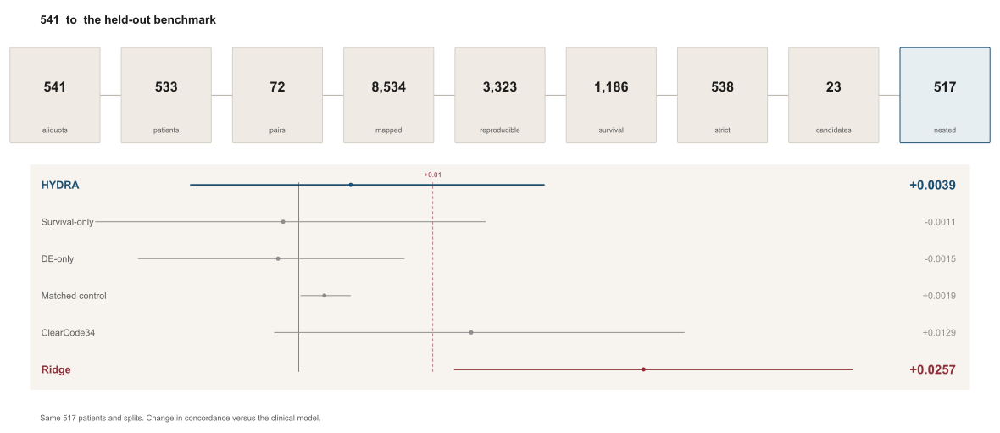

# HYDRA-ccRCC

**High-Discipline Reproducible Analysis of Clear Cell Renal Cell Carcinoma**



HYDRA-ccRCC tests whether genes dysregulated between clear cell renal cell carcinoma (ccRCC) and normal kidney also show prognostic associations. TCGA-KIRC supplies discovery data; GSE40435 and GSE53757 supply paired tumor-normal replication. Previously inspected GSE29609 and E-MTAB-1980 supply exploratory survival checks. Purity, marker scores, TRACERx Renal, and CheckMate 025 probe alternative explanations and transportability. This is an internal development study, not a validated biomarker panel. The [development manuscript](paper/main.pdf) is an AI-assisted draft that requires independent author verification before submission.

The locked result is that the one-gene funnel does not meet its prespecified held-out test. On 517 complete-case patients, mean concordance rose by 0.0039, and the patient-bootstrap interval conditional on the saved predictions runs from −0.0088 to 0.0171. That failure is not evidence that the 23 associations are null. A ridge model on the training-fold reproducible genes raised concordance by 0.0257, with an interval above 0.01, but that arm was specified after the one-gene rule, it was not the acceptance test, and its Brier interval still crosses zero. The increment compares a joint fit with a separate clinical model, so it includes any change in the clinical coefficients. The penalty does not name the genes that carry the gain. The ridge arm is not a validated signature. The ridge model was fit only on the TCGA nested splits and was not evaluated on GSE29609 or E-MTAB-1980. The unpaired GSE53757 check keeps all 23 high-confidence genes and does not prove that the inferred adjacent-row pairs are real patients. None of these results is a clinical action. TRACERx agreement across genes was 98.5% [76.6–100] when the same 39 patients are kept and only the region changes, and 86.3% [77.8–93.1] when membership is redrawn. The median alone overstates stability. Those draws have nine deaths and do not explain the GSE29609 reversals. Marker-score adjustment removes FDR support for CLCN5, DDC, GJB1, HIBCH, KL, and PODXL; consensus-purity adjustment keeps all 23.

The corrected primary analysis selects one TCGA primary tumor per patient by highest raw-count library depth, breaking ties by barcode, and applies the same rule to normals. Those 533 patients include 175 deaths. The primary Cox model and the nested splits use the 517 of them with positive survival time and complete age, sex, stage, and grade (170 deaths). The other 16 fail one field each: eight lack grade, three lack stage, one lacks age, and four have survival time recorded as zero. Five of those 16 are deaths. The stage-only sensitivity has 525 patients and the grade-only sensitivity has 520. The flow is in [the cohort figure](results/figures/cohort_flow.png). Cohort size, tissue, platform, and inspection status are in the [cohort dictionary](results/tables/cohort_dictionary.csv). Gene-identifier collapse rules are in the [gene-mapping table](results/tables/gene_mapping_rules.csv). The earlier analysis counted three aliquots from each of four patients as independent tumors. Its 541 tumor samples and 27-gene set remain in Git history; the corrected analysis uses 533 tumor patients and yields 23 high-confidence candidates. [The candidate delta](results/tables/prior_candidate_delta.csv) records three additions, seven removals, and 20 retained genes. External outcomes do not enter the selection rule, but earlier versions had already inspected those cohorts, so they cannot provide untouched validation.

## What the pipeline includes

- **Patient-level discovery:** TCGA differential expression and survival analyses use one selected tumor per patient. A 72-pair TCGA tumor-normal analysis checks the discovery directions.
- **Paired GEO replication:** GSE40435 has 101 tumor-normal pairs and GSE53757 has 72. Limma models block on pairs and use surrogate variables if estimated; GSE53757 pair IDs are inferred from sample order rather than independently verified patient identifiers.
- **Survival sensitivity:** Proportional-hazards tests are diagnostics rather than selection gates. An all-gene `apeglm` analysis removes the hard fold-change gate and applies one global survival FDR correction.
- **Selection-aware prediction:** Ten repeats of five outer patient-level folds rerun candidate selection and training-only scaling. The comparator is a clinical-only model; a fold with no selected gene uses its clinical-only prediction.
- **Conditional uncertainty:** A separate 1,000-bootstrap coefficient analysis and per-gene held-out comparison characterize the full-data selected candidates. They do not estimate selection optimism.
- **Alternative explanations and transportability:** Matched-patient purity and marker-score fits, nonlinear and time-varying survival checks, TRACERx region draws, and CheckMate 025 treatment interactions test narrower hypotheses.
- **Reproducibility controls:** Cached input hashes, package versions, output checksums, patient joins, pair counts, survival-event coding, candidate coverage, and FDR calculations are checked. Original retrieval dates for cached inputs were not recorded.

## Results

### Evidence funnel

| Metric | Corrected value |
| --- | ---: |
| TCGA selected primary tumor / normal patients | 533 / 72 |
| TCGA selected tumor-normal pairs | 72 |
| GSE40435 / GSE53757 tumor-normal pairs | 101 / 72 |
| TCGA-significant genes after symbol mapping | 8,534 |
| Reproducible DEGs | 3,323 |
| Main Cox FDR candidates | 1,186 |
| Sensitivity-model pass | 1,117 |
| Strict candidates | 538 |
| High-confidence candidates | 23 |

The [funnel table](results/tables/candidate_summary.csv) reports each gate, and the [gene-level evidence table](results/tables/high_confidence_candidate_evidence.csv) lists the 23 genes alphabetically. All 23 retain their tumor-normal direction in the paired TCGA sensitivity, while 17 meet its differential-expression threshold. These counts describe selection within the discovery data; they are not external replication rates.

### Hard-threshold sensitivity

All 32,192 count-QC genes were fit in the age-, sex-, stage-, and grade-adjusted Cox sensitivity analysis. One global BH correction retained 12,630 at survival FDR below 0.05. This broad association burden makes the [all-gene analysis](results/tables/tcga_kirc_apeglm_all_gene_survival_summary.csv) a check on the fold-change gate, not a replacement shortlist or evidence that 12,630 genes are useful biomarkers.

### External survival checks

GSE29609 has 39 patients and 17 deaths. Of 23 candidates, 21 mapped, five kept the TCGA hazard direction, none had same-direction nominal support, and four had nominal opposite-direction associations. `DDC` and `TCIRG1` reversed with FDR below 0.05. The small event count limits individual estimates, but these [contradictory results](results/tables/external_survival_gse29609_summary.csv) rule out uniform external replication.

E-MTAB-1980 has 101 patients and 23 deaths. Of 23 candidates, 22 mapped, 21 kept the TCGA direction, 13 had same-direction FDR support, and 12 met the strict unadjusted and limited-adjustment rule. This [more favorable cohort](results/tables/external_survival_emtab1980_summary.csv) does not cancel the GSE29609 reversals. Both cohorts were inspected before the present rule was finalized and are exploratory. The counts are in [the direction figure](results/figures/external_direction_comparison.png): 5/21 on GSE29609 and 21/22 on E-MTAB-1980, with 12 strict. DDC and TCIRG1 are the GSE29609 reversals.

At 22 genes per rule, the [matched-list funnel comparison](results/tables/funnel_external_gene_results.csv) tested the complete rule against survival-only, DE-only, both leave-one-GEO-out variants, and expression-matched controls. The complete-minus-survival-only directional-rate difference was 0.042 in GSE29609, with a paired gene-bootstrap 95% interval from -0.194 to 0.270, and zero in E-MTAB-1980. The prespecified external-funnel criterion failed. Different mapping denominators and correlation among genes further limit these descriptive intervals.

### Bootstrap uncertainty and held-out prediction

All 23 full-data selected candidates had conditional patient-bootstrap coefficient intervals excluding zero. The separate conditional per-gene cross-validation gave positive mean concordance increments for all 23. Both analyses reuse full-data selection, so neither shows what a new patient can expect from the entire selection procedure.

<!-- nested-results:start -->
The [selection-aware nested CV](results/tables/nested_cv_summary.csv) used 517 patients across ten repeats of five folds. It selected no gene in 0 folds; 2 folds required a DESeq2 no-replacement retry. The top-ranked gene varied across 10 genes, with the most frequent selected in 22 folds. The [selection-frequency figure](results/figures/nested_gene_selection_frequency.png) shows those ten genes. The mean selected-gene minus clinical concordance was +0.0039 (patient-resampled 95% interval -0.0088 to +0.0171), and the three-year Brier-score difference was -0.0009. The prespecified CV criterion **failed**. Mean risk-score calibration slopes were 0.86 for clinical-only and 0.76 for the selected-gene models, so discrimination and calibration did not move together. The [200 clinical-only null simulations](results/tables/nested_cv_clinical_null_summary.csv) selected a gene in 3 single-fold runs under their simulated clinical-risk model. The patient bootstrap keeps the fitted fold models fixed, so its interval omits training-set and split uncertainty.
<!-- nested-results:end -->

<!-- benchmark-results:start -->
The [nested selection benchmark](results/tables/nested_benchmark_summary.csv) reused those 517 patients and the same ten-by-five splits. The HYDRA arm matched the saved nested-CV gene in every fold. Its concordance increment was +0.0039 (patient-resampled 95% interval -0.0081 to +0.0183). Survival-only selection changed concordance by -0.0011 (interval -0.0151 to +0.0139) across 20 genes, and differential-expression-only selection changed it by -0.0015 (interval -0.0120 to +0.0079) across 5 genes. Both made the mean three-year Brier score worse. An expression-matched control, varying across 44 genes, changed concordance by +0.0019 (interval +0.0001 to +0.0039). That interval is above zero and the gain is still several times smaller than 0.01, so a small nonzero lower bound is not a useful gain. Ridge-penalized Cox regression on the training-fold reproducible genes, averaging 3,335 genes per fold, changed concordance by +0.0257 (interval +0.0116 to +0.0413). That interval clears 0.01. The mean Brier difference was -0.0063 (interval -0.0141 to +0.0017), so the probability-score improvement is not stable under patient resampling. Calibration slopes were 0.86 for the clinical model, 0.76 after the HYDRA gene, and 0.87 after the ridge model. The one-gene rules stayed near the clinical model. The ridge result means the eligible set still carries held-out ranking information when those genes are used together and the penalty is chosen inside the training fold. The ridge arm is not a validated signature. It does not replace the failed one-gene criterion. It was fit only on the TCGA nested splits and was not evaluated on GSE29609 or E-MTAB-1980. It was not the prespecified acceptance test, GEO evidence stayed fixed, and the patient bootstrap does not refit selection. The side-by-side comparison, including ClearCode34, is in [the master figure](results/figures/master_funnel_benchmark.png). Repeat-level increments are in [the benchmark figure](results/figures/nested_selection_benchmark.png).
<!-- benchmark-results:end -->

The one-gene criterion required a concordance increment of at least 0.01, a patient-level 95% interval above zero, and no worse three-year Brier score. The HYDRA increment misses the size threshold and its interval crosses zero. The null simulations characterize gene selection under their specified clinical-risk model; they are not a p-value for the repeated-CV increment. A second null, which permutes training survival on the saved repeat-1 expression fits, selected a gene in 0 of 200 simulations. The ridge concordance interval clears 0.01, but that comparison was not this acceptance test, and its Brier interval still crosses zero.

### Aliquot rule, GSE53757 pairing, and published scores

The 541 tumor aliquots and 533 patients differ by eight samples, all from four patients with three aliquots. Dropping those patients left 19 high-confidence genes, the first barcode left 20, and summing tumor counts left 19. GRAMD1A, IFFO1, LTB4R, and RBM47 were lost under every alternate rule. The deepest-library rule remains primary. The counts are in [the aliquot figure](results/figures/aliquot_sensitivity.png) and [the aliquot summary](results/tables/aliquot_sensitivity_summary.csv).

GSE53757 has no shared patient id for every pair. All 72 adjacent pairs are opposite tissues and the same stage, and four also share a title token. The unpaired limma sensitivity kept all 23 high-confidence genes in the reproducibility gate. Jaccard overlap with the paired reproducible list was 0.998. The comparison is in [the pairing figure](results/figures/gse53757_pairing_sensitivity.png).

ClearCode34, with published ccA/ccB signs and 33 mapped genes, changed nested concordance by +0.0129 (patient-bootstrap interval -0.0018 to +0.0287). The interval crosses zero. On previously inspected E-MTAB-1980, adding the study subtype, CRYL1, or a signed panel to the limited clinical model did not produce an interval above zero. Definitions are in [the methods lock](docs/METHODS_LOCK.md). The cross-cohort log hazard ratios are in [the forest figure](results/figures/external_log_hr_forest.png).

### Composition and interpretation

In 516 matched complete-case TCGA patients with 170 deaths, direct consensus-purity adjustment retained all 23 candidate hazard directions and FDR associations. Marker-score adjustment on matched patients removed FDR support for six candidates: CLCN5, DDC, GJB1, HIBCH, KL, and PODXL. Each score is the mean of sample-standardized marker expression, then standardized across samples, using proximal-tubule, endothelial, immune, and stromal marker sets. A candidate that is itself a marker is left out of that score. These are bulk scores, not cell proportions, and they do not agree with the purity adjustment. The [comparison figure](results/figures/composition_marker_fdr.png) shows both FDRs. The [interpretation table](results/tables/candidate_interpretation_context.csv) records gene-specific caveats without ranking “lead” biomarkers. ACADM, CRYL1, and DDC are different evidence profiles in the [candidate matrix](results/tables/candidate_evidence_matrix.csv): a concordant metabolic association, the gene that could be scored on E-MTAB-1980, and an external reversal. They are not ranked winners.

No candidate had an FDR-significant nonlinear or time-varying survival diagnostic in the [shape sensitivity](results/tables/candidate_survival_shape_sensitivity.csv). That is limited evidence against these particular departures, not proof of proportional hazards. Human Protein Atlas cell-source information comes from normal tissue and cannot substitute for ccRCC tumor single-cell evidence. The [earlier 24-gene biological review](results/archive/legacy_biological_review_24_candidates.md) is retained as a superseded historical record.

### Multiregion transportability

TRACERx linked 186 primary-tumor regions to 73 survival-linked patients, including 16 deaths; 58 patients had multiple regions, and all 23 candidates mapped. The 39-patient subset is size-matched to GSE29609 and has nine deaths. Across genes, agreement was 98.5% [76.6–100] when those patients were fixed and only the region varied, and 86.3% [77.8–93.1] when patient membership varied as well. The [draw-level distributions](results/figures/tracerx_sampling_distributions.png) show the same 1,000 repeats as a fraction of the 23 genes. This is a sampling-variation check. It does not establish that regional sampling caused the GSE29609 reversals.

### Randomized treatment interaction

The CheckMate 025 RNA-linked subset contains 250 patients, 120 assigned nivolumab and 130 everolimus, with 191 overall-survival and 222 progression-free-survival events. All 23 candidates mapped. Three overall-survival interactions were nominal in the unadjusted and adjusted models, but none survived within-endpoint, within-model FDR correction for either endpoint. The [interaction results](results/tables/checkmate025_candidate_treatment_interactions.csv) do not support a treatment-selection claim; this previously inspected subset is not an independent randomized confirmation cohort.

## Run the pipeline

From the repository root on Windows with R 4.6.1 and MiKTeX:

```powershell
.\run_pipeline.ps1 -SkipInstall
.\build_paper.ps1
```

`-SkipInstall` uses the existing local R library. The exact recorded versions are in the [package lock](environment/package_versions.csv). Allow several gigabytes of free disk space because regeneration writes a temporary DESeq2 RDS before replacing its cache. `-ForceDownload` refreshes public inputs and the input manifest; it is not a reproduction from the cached inputs. The [protocol](protocol.md) specifies model and acceptance rules.

## Key outputs

- [Input manifest](results/tables/input_manifest.csv): paths, sizes, and hashes for 638 cached public inputs. [Input verification](analysis/00_verify_inputs.R) checks them before analysis.
- [Funnel and candidate evidence](results/tables/candidate_summary.csv): corrected selection counts, with the joined 23-gene matrix in [candidate evidence](results/tables/candidate_evidence_matrix.csv).
- [Master figure](results/figures/master_funnel_benchmark.png): the left-to-right count flow ending in the held-out benchmark. HYDRA and ridge are marked. The ridge arm is not a validated signature.
- [Ridge specification](results/tables/ridge_specification.csv) and [fold audit](results/tables/ridge_fold_audit.csv): training-only $\lambda$, penalty, and preprocessing boundaries.
- [Nested selection code](analysis/22_nested_cv.R) and [prediction results](results/tables/nested_cv_summary.csv): patient-level outer CV, clinical comparison, Brier scores, calibration, and uncertainty.
- [Nested selector benchmark](analysis/31_nested_selection_benchmark.R) and [its summary](results/tables/nested_benchmark_summary.csv): same outer splits scored for the clinical model, HYDRA, survival-only, differential-expression-only, ridge, and a matched control.
- [Funnel ablation results](results/tables/funnel_external_gene_results.csv): every rule, external mapping, null result, and reversal.
- [Conditional bootstrap](results/tables/candidate_cox_bootstrap_summary.csv) and [per-gene CV](results/tables/candidate_cv_clinical_increment.csv): descriptive analyses that retain the full-data selection condition.
- [Purity](results/tables/candidate_direct_tumor_purity_sensitivity.csv), [marker scores](results/tables/candidate_clinical_composition_sensitivity.csv), [TRACERx](results/tables/tracerx_candidate_multiregion_summary.csv), and [CheckMate 025](results/tables/checkmate025_candidate_treatment_interactions.csv): sensitivity and exploratory comparisons.
- [Cohort dictionary](results/tables/cohort_dictionary.csv), [gene-mapping rules](results/tables/gene_mapping_rules.csv), [selection frequency](results/figures/nested_gene_selection_frequency.png), [composition FDRs](results/figures/composition_marker_fdr.png), and [TRACERx draw distributions](results/figures/tracerx_sampling_distributions.png).
- [Acceptance criteria](results/tables/acceptance_criteria.csv) and [run manifest](results/tables/run_manifest.csv): scientific pass/fail status and generated-file checksums. [Output validation](analysis/12_validate_outputs.R) checks counts, joins, candidate coverage, and FDR calculations.
- [Study overview](paper/figures/hydra_evidence_overview.svg): the same flow and benchmark, placed at the start of the [development manuscript](paper/main.tex). The 23-gene table is [the evidence matrix](paper/evidence_matrix.tex).
- [Cohort flow](results/figures/cohort_flow.png), [external direction](results/figures/external_direction_comparison.png), [GSE53757 pairing](results/figures/gse53757_pairing_sensitivity.png), and [aliquot sensitivity](results/figures/aliquot_sensitivity.png).
- [Manuscript source](paper/main.tex) and [development PDF](paper/main.pdf): interpretations tied to the regenerated tables.

## Scientific guardrails

- Continuous-expression Cox models are primary; median splits do not select candidates.
- PH diagnostics do not gate candidates, and a nonsignificant diagnostic does not prove proportional hazards.
- Missing external mappings, null results, and opposite-direction associations remain visible.
- Nested CV measures the complete training-set selection procedure; the conditional bootstrap and per-gene CV do not.
- The all-gene `apeglm` analysis is a sensitivity, not a retrospectively expanded candidate set.
- The funnel and nested-CV scientific acceptance criteria both failed; neither is described as confirmed superiority.
- The ridge comparison is a separate statement about the eligible gene set inside TCGA. The ridge arm is not a validated signature. It does not replace the failed one-gene criterion, and it was not evaluated on GSE29609 or E-MTAB-1980. The concordance increment includes jointly re-estimated clinical coefficients and does not isolate a gene subset.
- The permutation null selected a gene in 0 of 200 simulations. That frequency is not a p-value for the nested concordance increment.
- ClearCode34's nested concordance interval includes zero. It does not replace the failed one-gene criterion.
- GRAMD1A, IFFO1, LTB4R, and RBM47 leave the high-confidence set under every alternate aliquot rule. The deepest-library set remains primary.
- Consensus purity is an estimate, marker scores are proxies, and HPA normal-tissue cells are not tumor single-cell validation.
- RNA associations establish neither protein effects nor mechanisms, therapeutic targets, causation, or clinical utility.
- The strongest supported gene-level label is **candidate prognostic association**.

## Acknowledgment

The earlier development draft acknowledged Levi Waldron, Michael Love, Philip Saylor, Samra Turajlić, and David McDermott for feedback. The author must verify those attributions and the manuscript independently before submission; responsibility for the implementation and interpretation remains with the author.

## Completion state

The corrected cached-input pipeline, output checks, and development PDF build complete with the recorded R 4.6.1 environment. The input manifest pins the cached files, but their original retrieval dates are unavailable. The prespecified prediction and external-funnel criteria failed. The concordance increment of +0.0039 is the locked held-out result; the ridge increment is not a substitute success. TRACERx agreement across genes was 98.5% [76.6–100] with patients fixed and 86.3% [77.8–93.1] when patient membership was redrawn. The ridge arm is not a validated signature. Marker scores and consensus purity disagree on six genes. On the same splits, one-gene alternatives also stayed near the clinical model, while a training-fold ridge model on the reproducible set cleared the 0.01 concordance line and still had a Brier interval that crossed zero. A permutation of training survival selected a gene in 0 of 200 simulations. ClearCode34 changed nested concordance by +0.0129, and its interval from -0.0018 to +0.0287 still includes zero. Four high-confidence genes depend on the aliquot rule. The ridge gain is not separated from the joint clinical refit. Untouched external patients, ccRCC tumor single-cell and protein evidence, and an independent randomized treatment cohort remain unavailable for stronger validation claims. This development PDF is not an IRIS or ISEF submission. The student has to write the synopsis, paper, abstract, poster, and citations, and be able to explain the held-out result without this draft.
