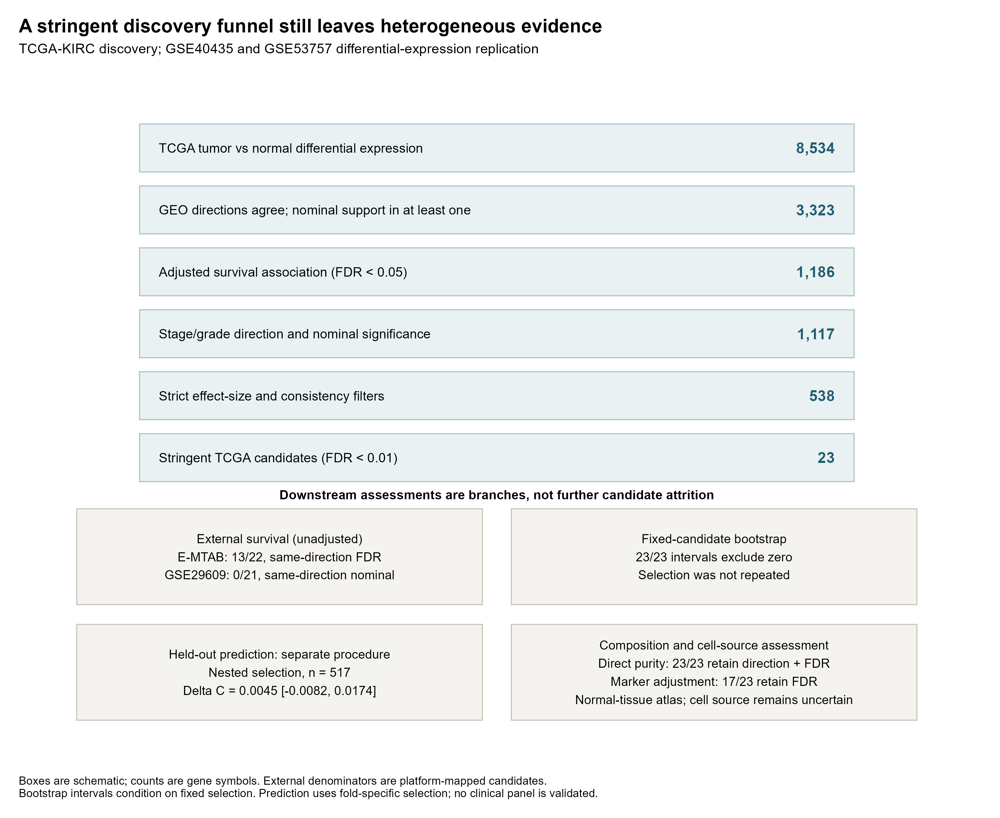

# HYDRA-ccRCC

HYDRA is a computational-genomics evidence-hardening study. It asks which tumor-normal transcriptomic associations in clear cell renal cell carcinoma retain prognostic support under expression replication, clinical adjustment, held-out evaluation, and tissue-composition checks. It contributes a reproducible workflow and evidence audit, not a new statistical algorithm or a validated clinical panel.

The discovery funnel is 8,534 -> 3,323 -> 1,186 -> 1,117 -> 538 -> 23 genes. External survival, coefficient uncertainty, prediction, purity, and cell-source analyses assess the shortlist; they are not further exclusion gates.

Survival direction agrees for 5/21 mapped genes in GSE29609 and 21/22 in E-MTAB-1980. Both cohorts were previously inspected. The selection-aware one-gene procedure changes held-out concordance by 0.0045 in 517 patients, with a conditional patient-bootstrap 95% interval of -0.0082 to 0.0174, and fails the project's prediction criterion. These results do not establish clinical utility.



## Manuscript and evidence

- [Revised manuscript](paper/main.pdf) and [LaTeX source](paper/main.tex), with procedural details and complete tables in [the supplement](paper/supplement.tex).
- [Candidate ledger](results/tables/candidate_ledger.csv) contains one row per mapped gene and cohort/model evidence; [the schema](docs/CANDIDATE_LEDGER_SCHEMA.md) explains missing assessments and diagnostic branches.
- [Review response matrix](docs/ICBINB_REVIEW_RESPONSE_MATRIX.md) connect the revision to the supplied review summary.
- [Validation record](docs/REVIEW_VALIDATION.md) and [command log](results/tables/revision_command_log.csv) report execution status; the [artifact inventory](results/tables/review_artifact_sources.csv) links every maintained output to its source and producer.
- [Overview figure edit guide](docs/HYDRA_OVERVIEW_FIGURE_EDIT_GUIDE.md) records why the old main-branch overview remains excluded and what to change before placing it after the abstract.
- [Protocol](protocol.md), [input hashes](results/tables/input_manifest.csv), and [package versions](environment/package_versions.csv) specify reproduction. Original cached-input retrieval dates are unknown.

## Regeneration

From the repository root, using R 4.6.1, the locked local R library, and MiKTeX:

```powershell
.\run_pipeline.ps1 -SkipInstall
.\build_paper.ps1
```

The pipeline validates cached public input hashes before analysis. Primary nested-fold checkpoints are reused only when recorded source/input signatures match. Stage 44 can migrate benchmark metadata after exact source-equivalence, recorded preprocessing, and fresh primary-prediction checks; original checkpoints and hashes are preserved, and reused models are identified explicitly. `-ForceDownload` refreshes inputs and is a new retrieval, not reproduction from the saved inputs. Leave several gigabytes of free disk space for atomic DESeq2 cache writes and Windows paging.

After a failed stage has been repaired and successfully rerun, `-StartAt analysis/11_hardening_outputs.R` can resume from that named stage; prior outputs must already be validated. [Validation record](docs/REVIEW_VALIDATION.md) distinguish failures, retries, and cache checks from scientific results.

Stage 33 can reuse a complete permutation result only when source, inputs, first-repeat caches, R/package versions, and resampling count match its recorded signature. Cached resampling results are identified in the execution log.

The submitted commit is `1f345735013853f3a3c09a088475fc177329369f`, preserved under `icbinb-bio-2026-submitted`. The revision branch is `icbinb-review-improvements`. AI assisted this development draft; author verification is required before submission. No clinical decision or patient benefit was evaluated.
